# Site Guard 🛡️

A modern, asynchronous website monitoring tool that helps administrators detect problems on their sites by periodically checking availability and content requirements.

[](https://www.python.org/downloads/)
[](https://opensource.org/licenses/MIT)
[](https://github.com/astral-sh/ruff)
[](https://mypy.readthedocs.io/)
[](https://docs.pydantic.dev/)
[](https://github.com/mikeleppane/site-guard/actions/workflows/ci.yml)


## 🚀 Features

- **Asynchronous Monitoring**: Efficiently checks multiple sites concurrently using `aiohttp`
- **Content Validation**: Verifies that pages contain required text or elements
- **Flexible Configuration**: YAML/JSON configuration with customizable timeouts and intervals
- **Structured Logging**: Beautiful console output with structured JSON logs using Loguru
- **Error Classification**: Distinguishes between connection errors and content validation failures
- **Performance Metrics**: Measures and reports response times for each check
- **Log Rotation**: Automatic log rotation and compression to manage disk space

## 📋 Requirements

- Python 3.11 or higher
- Internet connection for monitoring external sites

⚠️ This project has been developed and tested with Python 3.13 on Ubuntu 24.04 LTS. On Windows, it should work as well, but it has not been tested yet.

# emoji for heads-up

## 🔧 Installation

### From Source

```bash
git clone <repository-url>
cd site-guard
pip install -e .
```

### Development Setup

```bash
git clone <repository-url>
cd site-guard
pip install -e ".[dev]"
pre-commit install
```

Makefile commands for development: if you have `make` installed, you can use the following commands to manage the project:

```bash
make test             # Run all tests
make test-unit        # Run unit tests only
make test-integration # Run integration tests only
make check            # Run linters source + tests
make check-only-src   # Run linters on source code only
make format           # Format code with ruff-format
```

make can be install on Ubuntu with `sudo apt install make`, on macOS with `brew install make`, and on Windows with `choco install make`.

## 🚦 Quick Start

1. **Create a configuration file** (`config.yaml`):

```yaml
check_interval: 30  # seconds
log_file: "site_guard.log"
sites:
  - url: "https://example.com"
    content_requirement: "Example Domain"
    timeout: 10
  - url: "https://httpbin.org/json"
    content_requirement: "slideshow"
    timeout: 15
```

2. **Run the monitor**:

```bash
site-guard --config config.yaml
```

3. **Monitor with custom settings**:

```bash
# Override check interval
site-guard --config config.yaml --interval 60

# Enable verbose logging
site-guard --config config.yaml --verbose

# Save application logs to file
site-guard --config config.yaml --log-file app.log
```

## ⚙️ Configuration

### Configuration File Format

Site Guard supports both YAML and JSON configuration files:

```yaml
# Monitoring settings
check_interval: 30        # Check interval in seconds
log_file: "monitoring.log" # Path to monitoring results log

# Sites to monitor
sites:
  - url: "https://www.python.org/"
    content_requirement: "Python"
    timeout: 10
  - url: "https://www.rust-lang.org/"
    content_requirement: "Rust"
    timeout: 15
```

### Configuration Options

| Option | Type | Description | Default |
|--------|------|-------------|---------|
| `check_interval` | integer | Time between monitoring rounds (seconds) | 60 |
| `log_file` | string | Path to monitoring results log file | `site_guard.log` |
| `sites` | array | List of sites to monitor | Required |
| `sites[].url` | string | URL to monitor | Required |
| `sites[].content_requirement` | string | Text that must be present in response | Required |
| `sites[].timeout` | integer | Request timeout in seconds | 30 |

## 📊 Output and Logging

### Console Output

Site Guard provides colorized console output showing the status of each check:

```
2025-06-08 19:11:51.860 | INFO     | site_guard.main:main:49 - Site Guard starting...
2025-06-08 19:11:51 | INFO     | site_guard.application.monitoring_app:run:39 - Starting site monitoring with 5 sites
2025-06-08 19:11:51 | INFO     | site_guard.application.monitoring_app:run:40 - Check interval: 30.0 seconds
2025-06-08 19:11:51 | INFO     | site_guard.application.monitoring_app:run:51 - Starting monitoring round...
2025-06-08 19:11:52 | INFO     | site_guard.application.monitoring_app:run:59 - PASS ✓: https://www.python.org/ - 229ms
2025-06-08 19:11:52 | INFO     | site_guard.application.monitoring_app:run:59 - PASS ✓: https://go.dev/ - 397ms
2025-06-08 19:11:52 | WARNING  | site_guard.application.monitoring_app:run:65 - FAIL ✗: https://www.modular.com/mojo23232 - CONNECTION_ERROR: HTTP 404: Not Found
2025-06-08 19:11:52 | INFO     | site_guard.application.monitoring_app:run:59 - PASS ✓: https://httpbin.org/html - 704ms
2025-06-08 19:11:52 | INFO     | site_guard.application.monitoring_app:run:59 - PASS ✓: https://www.rust-lang.org/ - 706ms
2025-06-08 19:11:52 | INFO     | site_guard.application.monitoring_app:run:68 - Monitoring round completed: 4 successful, 1 failed
```

### Log Files

Monitoring results are saved to structured JSON logs:

```json
{
  "timestamp": "2025-06-06T10:30:01.123456",
  "url": "https://example.com",
  "status": "success",
  "response_time_ms": 245,
  "error_message": null,
  "check_type": "site_monitoring"
}
```

## 🏗️ Project Structure

Site Guard follows clean architecture principles with clear separation of concerns:

```
src/site_guard/
├── main.py              # Entry point for the CLI application
├── domain/              # Business logic and rules
│   ├── models/         # Data models (SiteConfig, CheckResult)
│   ├── services/       # Service interfaces
│   └── repositories/   # Repository interfaces
├── application/        # Use cases and orchestration
│   └── monitoring_app.py
└── infrastructure/     # External integrations
    ├── http/          # HTTP client implementation
    ├── persistence/   # Configuration and logging
    └── logging/       # Logging setup
└── tests/             # Unit and integration tests
    ├── unit/          # Unit tests for domain logic
    └── integration/   # Integration tests for application behavior
```

## 🏗️ Architecture

### Architecture Diagram

```mermaid
graph TB
    %% Entry Point
    CLI["`**CLI Entry Point**
    main.py
    Click Commands`"]

    %% Application Layer
    APP["`**Application Layer**
    MonitoringApplication
    Orchestrates monitoring workflow`"]

    %% Domain Layer
    subgraph DOMAIN["`**Domain Layer (Business Logic)**`"]
        MODELS["`**Models**
        • SiteConfig
        • SiteCheckResult
        • CheckStatus
        • ContentRequirement`"]

        SERVICES["`**Services**
        • MonitoringService
        • SiteChecker (Interface)`"]

        REPOS["`**Repositories**
        • ConfigLoader (Interface)`"]
    end

    %% Infrastructure Layer
    subgraph INFRA["`**Infrastructure Layer**`"]
        HTTP["`**HTTP Client**
        HttpSiteChecker
        aiohttp session management`"]

        CONFIG["`**Configuration**
        FileConfigLoader
        YAML/JSON parsing`"]

        LOGGING["`**Logging**
        • FileLogger
        • LogRotation
        • Loguru integration`"]

        PERSIST["`**Persistence**
        File-based storage`"]
    end

    %% External Systems
    subgraph EXTERNAL["`**External Systems**`"]
        WEBSITES["`**Target Websites**
        HTTP/HTTPS endpoints`"]

        FILES["`**File System**
        • Config files
        • Log files`"]
    end

    %% Data Flow
    CLI --> APP
    APP --> SERVICES
    APP --> CONFIG
    APP --> LOGGING

    SERVICES --> HTTP
    SERVICES --> MODELS

    HTTP --> WEBSITES
    CONFIG --> FILES
    LOGGING --> FILES

    %% Dependencies
    HTTP -.-> MODELS
    CONFIG -.-> MODELS
    LOGGING -.-> MODELS

    %% Styling
    classDef entryPoint fill:#e1f5fe,stroke:#01579b,stroke-width:2px
    classDef application fill:#f3e5f5,stroke:#4a148c,stroke-width:2px
    classDef domain fill:#e8f5e8,stroke:#1b5e20,stroke-width:2px
    classDef infrastructure fill:#fff3e0,stroke:#e65100,stroke-width:2px
    classDef external fill:#fce4ec,stroke:#880e4f,stroke-width:2px

    class CLI entryPoint
    class APP application
    class DOMAIN,MODELS,SERVICES,REPOS domain
    class INFRA,HTTP,CONFIG,LOGGING,PERSIST infrastructure
    class EXTERNAL,WEBSITES,FILES external
```



### 🔄 Data Flow Diagram


### 🧩 Component Interaction


### 🔧 Configuration Flow


## 🧪 Development

### Running Tests

```bash
pytest
pytest --cov=site_guard --cov-report=html
make test
make test-unit # Run unit tests only
make test-integration # Run integration tests only
```

### Code Quality

```bash
# Format code
make format

# Lint code
make check-only-src  # `make check` to run linters against both source and tests

# Run tests
make test
```

### Project Structure

The project uses modern Python packaging with:
- **pyproject.toml**: Project configuration and dependencies
- **Ruff**: Fast linting and formatting
- **mypy**: Static type checking
- **pytest**: Testing framework
- **pre-commit**: Git hooks for code quality

## 🔍 Error Types

Site Guard classifies errors into distinct categories:

- **SUCCESS**: Site is accessible and content requirement is met
- **CONNECTION_ERROR**: Network issues, DNS resolution failures, HTTP errors (4xx/5xx)
- **CONTENT_ERROR**: Site is accessible but doesn't contain required content
- **TIMEOUT_ERROR**: Request exceeded the configured timeout

## 📝 Examples

### Help

```bash
Usage: site-guard [OPTIONS]

  Site Guard - Monitor website availability and content.

Options:
  -c, --config PATH       Path to configuration file (YAML or JSON)
                          [required]
  -i, --interval INTEGER  Check interval in seconds (overrides config file
                          setting)
  -v, --verbose           Enable verbose logging
  --log-file TEXT         Application log file (separate from monitoring
                          results log), defaults to 'site_guard.log'
  --help                  Show this message and exit.
```

### Basic Monitoring

```bash
site-guard --config sites.yaml
```

### High-Frequency Monitoring

```bash
site-guard --config critical-sites.yaml --interval 10 --verbose
```

### Production Deployment

```bash
site-guard --config production.yaml --log-file /var/log/site-guard/app.log
```

## 🗺️ Future Features & Roadmap

The following features are planned for future releases to enhance Site Guard's capabilities:

### 🔔 Phase 1: Alerting & Notifications
- [ ] **Email Notifications** - Send alerts when sites go down
- [ ] **Slack Integration** - Post monitoring alerts to Slack channels
- [ ] **SMS Alerts** - Critical failure notifications via SMS
- [ ] **Alert Thresholds** - Configurable failure count before alerting

### 📊 Phase 2: Metrics & Analytics
- [ ] **Prometheus Integration** - Export metrics for Grafana dashboards
- [ ] **Uptime Tracking** - Calculate and display uptime percentages
- [ ] **Response Time Trends** - Historical performance analysis
- [ ] **Performance Baselines** - Detect performance degradation

### 🗄️ Phase 3: Data Persistence
- [ ] **Database Storage** - PostgreSQL/SQLite for historical data
- [ ] **Data Retention Policies** - Automatic cleanup of old records
- [ ] **Export/Import Tools** - Backup and restore monitoring data

### 🌐 Phase 4: Advanced HTTP Features
- [ ] **Custom Headers** - Support for authentication headers
- [ ] **Basic/Bearer Auth** - Built-in authentication support
- [ ] **Cookie Handling** - Session-based monitoring

### 🔍 Phase 5: Enhanced Content Validation
- [ ] **CSS Selectors** - Check for specific DOM elements
- [ ] **XPath Support** - Advanced content location
- [ ] **JSON Path Validation** - API response validation
- [ ] **Response Size Limits** - Monitor payload sizes
- [ ] **Image/Binary Content** - Check for media availability
- [ ] **Form Submission Testing** - Validate form endpoints

### 📋 Phase 6: Status Pages & Dashboards
- [ ] **Public Status Pages** - Generate HTML status pages
- [ ] **Real-time Web Dashboard** - Live monitoring interface
- [ ] **Mobile-Responsive UI** - Monitor from any device
- [ ] **Custom Branding** - Branded status pages
- [ ] **Incident Timeline** - Historical incident tracking

### 🌍 Phase 7: Geographic & Load Testing
- [ ] **Multi-Region Monitoring** - Check from different locations
- [ ] **Load Testing** - Basic performance testing capabilities
- [ ] **CDN Performance** - Global endpoint monitoring
- [ ] **Network Path Analysis** - Trace route diagnostics

### 🎯 Phase 8: Smart Features
- [ ] **Intelligent Scheduling** - Adaptive check intervals
- [ ] **Dependency Tracking** - Monitor service dependencies
- [ ] **Anomaly Detection** - AI-based issue detection
- [ ] **Predictive Alerts** - Early warning systems
- [ ] **Auto-Recovery Testing** - Validate service recovery

### 🔌 Phase 9: Integrations & Extensibility
- [ ] **Plugin System** - Extensible architecture
- [ ] **Webhook Support** - Custom notification endpoints
- [ ] **API Endpoints** - REST API for external integrations
- [ ] **Datadog Integration** - Export to monitoring platforms
- [ ] **New Relic Support** - APM platform integration
- [ ] **Docker Health Checks** - Container monitoring

### Contributing to Features

We welcome contributions! If you're interested in implementing any of these features:

1. Check the [issues](https://github.com/your-repo/site-guard/issues) for existing discussions
2. Create a feature request issue for new ideas
3. Join the discussion on implementation approach
4. Submit a PR with your implementation

---

**Have ideas for other features?** [Open an issue](https://github.com/your-repo/site-guard/issues/new) and let's discuss!


## 🤝 Contributing

1. Fork the repository
2. Create a feature branch (`git checkout -b feature/amazing-feature`)
3. Make your changes
4. Run tests and linting (`pre-commit run --all-files`)
5. Commit your changes (`git commit -m 'Add amazing feature'`)
6. Push to the branch (`git push origin feature/amazing-feature`)
7. Open a Pull Request

## 📄 License

This project is licensed under the MIT License - see the [LICENSE](LICENSE) file for details.

## 🙏 Acknowledgments

- Built with [aiohttp](https://docs.aiohttp.org/) for async HTTP requests
- Logging powered by [Loguru](https://loguru.readthedocs.io/)
- CLI interface using [Click](https://click.palletsprojects.com/)
- Configuration validation with [Pydantic](https://docs.pydantic.dev/)

---

**Site Guard** - Keeping your websites healthy, one check at a time! 🏥✨
