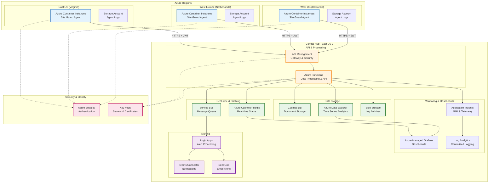
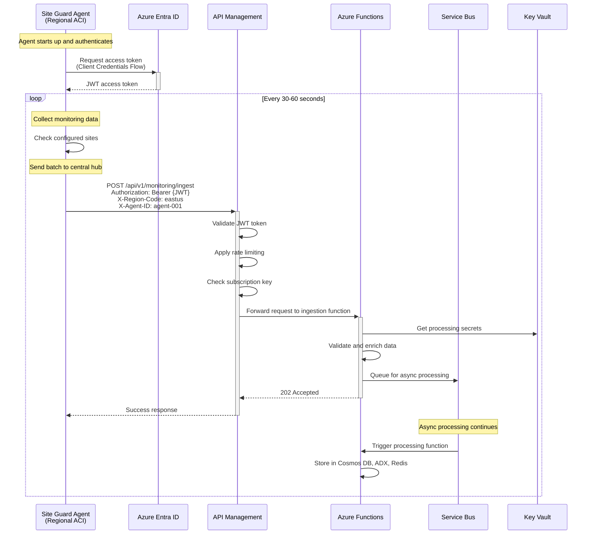

# Distributed Monitoring Architecture Design

## Introduction

This document outlines the architecture design for a distributed monitoring system capable of tracking connectivity and latency metrics across multiple geographically dispersed locations. The system is designed to provide real-time visibility into network performance and service availability from a global perspective, consolidating data from various monitoring agents into a centralized reporting platform. Overall, it's underlying architecture will much different than original single-node monitoring systems, as it needs to handle data from multiple sources, ensure secure transmission, and provide real-time insights across different regions.

For demonstration purposes, we will assume that this system will build on top of Azure and consider three regions: East-US (Virginia), UK West (Cardiff), and West US  (California). Each region will have its own monitoring agent that collects data from local sites and sends it to a central command for aggregation and analysis.

## Architecture Diagram

## 🔄 Communication Flow Overview

## Regional Agents

Each monitoring application runs in a separate Azure Container Instance (ACI) within its respective region. The agents are responsible for:
Collecting connectivity and latency metrics from local websites and services.

## Central Hub - API & Processing Layer

Azure API Management (APIM) serves as the secure gateway for all incoming data from regional agents. It handles:

- Ingesting data from regional agents
- Rate limiting and throttling to prevent abuse
- Authentication and authorization using JWT tokens
Azure Functions provide serverless compute capabilities for:
- Processing incoming data from agents
- Validating and enriching data
- Storing processed data into various storage solutions

This layer transforms regional monitoring data into processed, validated information while ensuring secure, scalable, and reliable communication between distributed agents and the central data platform.

## Data Storage Layer

Data storage layer consists of multiple components to handle different types of data:

- **Cosmos DB**: Stores structured monitoring data in a document format, allowing for fast queries and global distribution.
- **Azure Data Explorer (ADX)**: Optimized for time-series analytics, it provides powerful querying capabilities for large volumes of telemetry data.
- **Blob Storage**: Used for long-term archival of raw logs and data, ensuring cost-effective storage for large datasets.

## Real-time & Caching Layer

The Real-time & Caching Layer provides performance optimization and asynchronous message handling for our distributed monitoring system:

- **Azure Cache for Redis**: Provides real-time caching of status and metrics, enabling fast access to frequently queried data.
- **Service Bus**: Acts as a message queue for decoupling data ingestion from processing, allowing for asynchronous handling of incoming data and ensuring reliability in message delivery.

## Monitoring & Dashboards Layer

This layer provides real-time monitoring, visualization, and alerting capabilities:

- **Application Insights**: Monitors application performance and provides telemetry data for diagnostics and troubleshooting.
- **Azure Managed Grafana**: Offers customizable dashboards for visualizing metrics and performance data from various sources, including Cosmos DB and ADX.
- **Log Analytics**: Centralized logging solution that aggregates logs from all components, enabling powerful querying and analysis of system behavior.
- **Azure Monitor**: Provides comprehensive monitoring capabilities across all Azure resources, including alerts and metrics.

## Alerting Layer

The Alerting Layer is responsible for processing alerts and notifications based on monitoring data:

- **Logic Apps**: Automates alert processing workflows, allowing for complex logic and integration with other services.
- **Teams Connector**: Sends real-time notifications to Microsoft Teams channels for immediate visibility into critical issues.
- **SendGrid**: Used for sending email alerts to stakeholders, ensuring that critical notifications reach the right people.

## Security & Identity Layer

Azure Entra ID: Centralized identity management for:

- Authentication of agents and services
- Role-based access control (RBAC)

Key Vault: Secure storage for:

- Secrets, keys, and certificates
- Secure access to sensitive information
- Integration with APIM and Functions for secure operations
